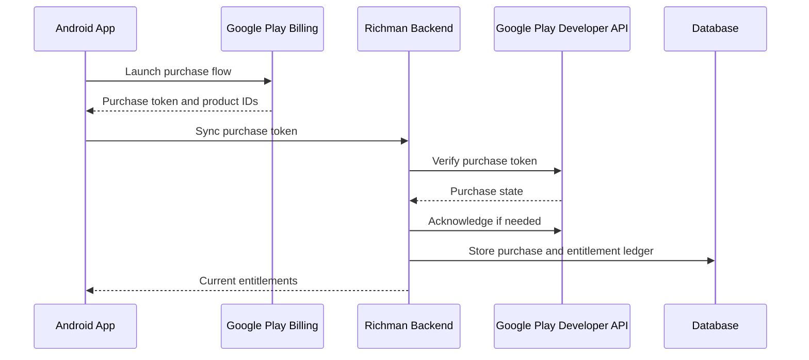

# Play Purchase Sync Backend PRD and Design

## Document Status

- Status: Draft
- Owner: Product / Engineering
- App package: `com.legendsoftware.richman`
- Target platform: Android app with Google Play Billing
- Primary goal: create a backend service that verifies Google Play purchases, stores purchase state, grants entitlements, and keeps purchase state synchronized after refunds, renewals, cancellations, and app reinstalls.

## Product Requirements Document

### Problem Statement

Richman currently uses Google Play Billing inside the Android app for coin packs, bundles, and subscriptions. Local app-side purchase handling is not enough for reliable entitlement management because users can reinstall the app, retry purchase callbacks, refund purchases, renew subscriptions, or move through subscription lifecycle states that the app may not observe in real time.

The project needs a backend purchase sync service that becomes Richman's source of truth for user entitlements while using Google Play as the payment source of truth.

### Goals

- Verify every purchase token with the Google Play Developer API before granting value.
- Grant one-time product entitlements exactly once per valid purchase.
- Track subscription entitlement state across purchase, renewal, cancellation, grace period, hold, pause, expiration, and refund scenarios.
- Support app reinstall and multi-device use by allowing the app to restore entitlements from the backend.
- Acknowledge valid purchases server-side when acknowledgement is required.
- Detect refunded or voided purchases and update entitlements.
- Provide an auditable purchase and entitlement history for debugging, support, and compliance.
- Keep Google service credentials out of the Android app and out of Git.

### Non-Goals

- Replacing Google Play Billing checkout in the Android app.
- Supporting non-Google payment providers in the first release.
- Building an admin dashboard in the first release.
- Implementing multiplayer, cloud save, or account migration features unless needed for purchase identity.
- Automatically deploying production infrastructure before hosting and credential ownership are confirmed.

### Users and Stakeholders

- Player: buys coins, bundles, or subscriptions and expects reliable access.
- Product manager: needs confidence that monetization works and can be audited.
- Engineer: needs clear purchase state, idempotency, logs, and failure recovery.
- Tester: needs predictable scenarios for Play closed testing.
- Support operator: needs enough purchase history to investigate user reports.

### Purchase Products In Scope

One-time products:

- `com.legendsoftware.richman.coins.50`
- `com.legendsoftware.richman.coins.100`
- `com.legendsoftware.richman.coins.200`
- `com.legendsoftware.richman.coins.500`
- `com.legendsoftware.richman.bundle.starter`

Subscriptions:

- `premium_basic_monthly`
- `premium_plus_monthly`
- `premium_pro_monthly`
- Legacy support: `premium_monthly`

### User Stories

- As a player, when I buy coins, my balance increases after the purchase is verified.
- As a player, when I buy a subscription, premium access becomes active after verification.
- As a player, when I reinstall the app, my active subscription and server-backed balance can be restored.
- As a player, if the app loses network after checkout, the app can retry syncing the purchase token later.
- As a product manager, I can trust that duplicate app callbacks do not grant duplicate coins.
- As a tester, I can verify successful purchase, retry, refund, and subscription lifecycle behavior.
- As support, I can trace a user's purchase token, order ID, product ID, entitlement grant, and current state.

### Functional Requirements

#### Android App

- Send successful Google Play purchases to the backend after BillingClient returns them.
- Include product IDs, purchase token, purchase type, package name, app user identifier, purchase time if available, and client app version.
- Retry failed sync attempts with backoff.
- Query backend entitlement state during app startup, purchase screen load, and after purchase sync.
- Keep local UI responsive, but do not permanently grant server-sensitive value until backend verification succeeds.
- Preserve support for querying existing purchases from Google Play and syncing unsynced tokens.

#### Backend API

- Provide an authenticated purchase sync endpoint for app clients.
- Verify product purchases with Google Play before granting.
- Verify subscription purchases with Google Play before activating premium entitlement.
- Acknowledge valid unacknowledged purchases where appropriate.
- Store raw normalized purchase state and internal entitlement changes.
- Make purchase sync idempotent by purchase token, order ID, product ID, and user ID.
- Provide an entitlement read endpoint for the app.
- Provide health check and basic diagnostics endpoints.

#### Entitlements

- Coin products grant fixed coin amounts once.
- Starter bundle grants the configured bundle contents once.
- Active subscriptions grant premium tier access according to product priority.
- If multiple subscriptions are active, the backend should resolve the highest active tier unless product rules say otherwise.
- Refunded, revoked, or voided purchases must be marked and handled according to product policy.

#### Refund and Revocation Handling

- Add a scheduled job that calls the Google Play Voided Purchases API.
- Store every voided purchase event.
- Reverse or flag coin entitlements according to the final product policy.
- Deactivate premium access when subscription state is no longer active.
- Avoid destructive balance changes without a ledger entry.

#### Real-Time Developer Notifications

- Add support for Google Play Real-time Developer Notifications through Pub/Sub.
- Treat notifications as triggers to re-fetch purchase state from Google Play, not as the final source of truth.
- Process subscription renewal, cancellation, grace period, hold, pause, recovery, expiration, and refund-related notifications.
- Make notification handling idempotent.

### Non-Functional Requirements

- Security: no Google service account secrets in the Android app or Git.
- Reliability: duplicate calls must not duplicate grants.
- Observability: log verification, acknowledgement, entitlement changes, and Google API errors.
- Privacy: store only purchase data needed for entitlement and support.
- Latency: normal purchase sync should complete within a few seconds when Google APIs are healthy.
- Recovery: failed Google API calls should be retryable without losing purchase tokens.
- Maintainability: product mapping should be centralized and easy to update.

### Success Metrics

- 100% of successful Play purchases are either verified and granted or recorded with a retryable failure.
- 0 duplicate coin grants from duplicate purchase callbacks.
- 0 unacknowledged valid purchases caused by backend sync logic.
- Subscription entitlement state matches Google Play state in closed testing scenarios.
- Voided purchase job can identify and record refunds from the last 30 days.

### Milestones

#### Milestone 1: Design and Planning

- Finalize this PRD and design.
- Confirm backend stack, hosting target, database, and authentication approach.
- Confirm Google Cloud / Play Console credential ownership.

#### Milestone 2: Backend Foundation

- Create backend service skeleton.
- Add database schema and migrations.
- Add product catalog config.
- Add health check and local test setup.

#### Milestone 3: Purchase Verification and Granting

- Add purchase sync endpoint.
- Integrate Google Play Developer API.
- Add one-time product verification, acknowledgement, and coin grants.
- Add subscription verification and premium grants.
- Add idempotency tests.

#### Milestone 4: Android Integration

- Add backend client to Android app.
- Sync purchases after checkout.
- Restore purchases on app startup.
- Read backend entitlements for UI state.

#### Milestone 5: Refund and Subscription Lifecycle

- Add voided purchase polling job.
- Add Real-time Developer Notifications endpoint.
- Add subscription lifecycle processing.
- Add logs and operational runbook.

#### Milestone 6: Closed Testing Validation

- Test one-time products, bundle, subscriptions, retries, app reinstall, duplicate sync, refund, and cancellation.
- Fix issues found during closed testing.
- Prepare production deployment checklist.

### Open Product Decisions

- What backend hosting platform should be used?
- What database should be used?
- Does Richman have user accounts now, or should the first version use an app-generated player ID?
- Should refunded coin purchases subtract coins, freeze account state, or only flag support review?
- Should coin balance be fully server-authoritative in this project, or should the first release only sync purchase receipts and premium access?
- What is the exact entitlement content of `com.legendsoftware.richman.bundle.starter`?

## Technical Design Document

### Architecture Overview

The Android app continues to use Google Play Billing for checkout. After purchase success, the app sends the purchase token to the backend. The backend verifies the purchase with Google Play, acknowledges it when needed, records the purchase, and writes entitlement ledger entries. The app then reads entitlement state from the backend.



### Proposed Backend Components

- API server: receives app purchase sync and entitlement requests.
- Purchase verifier: wraps Google Play Developer API calls.
- Product catalog: maps product IDs to internal entitlement rules.
- Entitlement service: grants coins and premium states through ledger entries.
- Scheduler: polls voided purchases.
- Notification handler: receives Pub/Sub push messages for Real-time Developer Notifications.
- Database: stores users, purchases, entitlement ledger, subscription states, and event logs.

### Suggested Technology Options

Recommended default if no existing backend exists:

- Runtime: Kotlin + Ktor or Java/Spring Boot, because the app is Android/Kotlin and Play API clients are mature on JVM.
- Database: PostgreSQL.
- Hosting: Google Cloud Run.
- Secrets: Google Secret Manager.
- Scheduled jobs: Cloud Scheduler.
- Notifications: Pub/Sub push to backend.

Alternative lightweight option:

- Runtime: Node.js + Fastify or Express.
- Database: PostgreSQL.
- Hosting: Cloud Run or Render.

The implementation should use whichever stack best matches existing infrastructure if one already exists.

### Data Model

#### `app_users`

- `id`
- `external_user_id`
- `created_at`
- `updated_at`

#### `play_purchases`

- `id`
- `user_id`
- `package_name`
- `product_id`
- `purchase_token_hash`
- `purchase_token_encrypted`
- `order_id`
- `purchase_type`
- `purchase_state`
- `acknowledgement_state`
- `consumption_state`
- `quantity`
- `purchase_time`
- `last_verified_at`
- `raw_response_json`
- `created_at`
- `updated_at`

Unique indexes:

- `purchase_token_hash`, `product_id`
- `order_id`, `product_id` where `order_id` is present

#### `entitlement_ledger`

- `id`
- `user_id`
- `purchase_id`
- `entitlement_type`
- `entitlement_key`
- `delta_amount`
- `state`
- `reason`
- `created_at`

Examples:

- `coins`, `balance`, `+50`, `granted`
- `premium`, `premium_plus_monthly`, `active`, `subscription_verified`

#### `subscription_states`

- `id`
- `user_id`
- `purchase_id`
- `product_id`
- `purchase_token_hash`
- `base_plan_id`
- `offer_id`
- `state`
- `expiry_time`
- `auto_renewing`
- `cancel_reason`
- `linked_purchase_token_hash`
- `last_event_at`
- `created_at`
- `updated_at`

#### `play_voided_purchases`

- `id`
- `purchase_token_hash`
- `order_id`
- `voided_time`
- `purchase_time`
- `voided_source`
- `voided_reason`
- `voided_quantity`
- `raw_response_json`
- `created_at`

#### `purchase_sync_events`

- `id`
- `user_id`
- `purchase_id`
- `event_type`
- `status`
- `error_code`
- `error_message`
- `created_at`

### API Design

#### `POST /v1/play/purchases:sync`

Purpose: app sends a Play purchase token for verification and entitlement update.

Request:

```json
{
  "userId": "app-user-id",
  "packageName": "com.legendsoftware.richman",
  "purchaseType": "one_time",
  "productIds": ["com.legendsoftware.richman.coins.100"],
  "purchaseToken": "play-token",
  "clientPurchaseTime": "2026-05-24T00:00:00Z",
  "appVersion": "1.0.0"
}
```

Response:

```json
{
  "status": "verified",
  "entitlements": {
    "coins": 100,
    "premiumTier": null,
    "premiumExpiresAt": null
  }
}
```

#### `GET /v1/entitlements/me`

Purpose: app fetches current server-backed entitlement state.

Response:

```json
{
  "coins": 100,
  "premiumTier": "premium_plus_monthly",
  "premiumState": "active",
  "premiumExpiresAt": "2026-06-24T00:00:00Z"
}
```

#### `POST /v1/play/notifications`

Purpose: Pub/Sub push endpoint for Google Play Real-time Developer Notifications.

Behavior:

- Validate Pub/Sub message authenticity according to deployment setup.
- Decode notification.
- Store event.
- Re-fetch purchase state from Google Play.
- Update purchase and entitlement state idempotently.

#### `POST /internal/jobs/play/voided-purchases`

Purpose: scheduled job endpoint or internal task to poll voided purchases.

Behavior:

- Request voided purchases from Google Play.
- Store new voided events.
- Match against known purchases.
- Apply entitlement policy.

### Verification Logic

#### One-Time Product Flow

1. Receive purchase sync request.
2. Authenticate app/user request.
3. Validate package name and product ID against catalog.
4. Hash and lookup purchase token.
5. Call Google Play product purchase API.
6. Confirm purchase state is purchased.
7. Confirm product ID and package match request.
8. If unacknowledged, acknowledge server-side.
9. Insert or update purchase row.
10. Grant entitlement only if no previous grant exists for this purchase.
11. Return current entitlements.

#### Subscription Flow

1. Receive purchase sync request.
2. Authenticate app/user request.
3. Validate package name and subscription product ID.
4. Hash and lookup purchase token.
5. Call Google Play subscription purchase API.
6. Confirm subscription state and expiry.
7. If unacknowledged, acknowledge server-side.
8. Upsert purchase and subscription state.
9. Activate, downgrade, upgrade, or expire premium entitlement according to state.
10. Return current entitlements.

### Product Catalog Rules

Initial product mapping:

```text
com.legendsoftware.richman.coins.50    -> grant 50 coins
com.legendsoftware.richman.coins.100   -> grant 100 coins
com.legendsoftware.richman.coins.200   -> grant 200 coins
com.legendsoftware.richman.coins.500   -> grant 500 coins
com.legendsoftware.richman.bundle.starter -> grant starter bundle contents
premium_basic_monthly                  -> premium tier basic
premium_plus_monthly                   -> premium tier plus
premium_pro_monthly                    -> premium tier pro
premium_monthly                        -> legacy premium tier
```

Subscription tier priority:

```text
premium_pro_monthly > premium_plus_monthly > premium_basic_monthly > premium_monthly
```

### Idempotency Design

- Every purchase sync can be called many times safely.
- Purchase token hash plus product ID identifies a purchase record.
- Entitlement ledger prevents duplicate grants.
- Acknowledgement calls should tolerate already-acknowledged purchases.
- Notification events and voided purchase events should be deduplicated before processing.

### Security Design

- Android app never stores Google service account credentials.
- Backend stores Google credentials only in the hosting secret manager.
- Purchase tokens are encrypted at rest or stored only as hashes plus encrypted value when re-verification is needed.
- Backend endpoints require app/user authentication.
- Logs must not print raw purchase tokens or service account secrets.
- Requests should include package name allowlist checks.

### Observability

Minimum logs:

- Purchase sync received.
- Google verification result.
- Acknowledgement attempt and result.
- Entitlement grant or no-op idempotent result.
- Voided purchase detected.
- Subscription notification processed.
- Google API failure with safe error details.

Minimum metrics:

- Purchase sync success/failure count.
- Google API latency and error count.
- Acknowledgement success/failure count.
- Duplicate sync count.
- Voided purchase count.
- Subscription state transition count.

### Testing Plan

#### Unit Tests

- Product catalog mapping.
- Idempotent coin grant.
- Subscription priority resolution.
- Duplicate purchase sync.
- Already acknowledged purchase.
- Google API error handling.
- Voided purchase matching.

#### Integration Tests

- Backend sync endpoint with mocked Google API.
- Entitlement read endpoint.
- Database migration and unique constraints.
- Notification endpoint with sample Pub/Sub payload.
- Voided purchase job with paginated responses.

#### Manual Closed Testing

- Buy each coin pack.
- Buy starter bundle.
- Buy each subscription tier.
- Retry purchase sync after network failure.
- Reinstall app and restore entitlement state.
- Cancel subscription.
- Refund one-time product.
- Verify duplicate callbacks do not duplicate grants.

### Rollout Plan

1. Build backend in local development with mocked Google API.
2. Add database and automated tests.
3. Add Android sync behind a feature flag or config switch.
4. Deploy backend to staging.
5. Configure Google credentials and Play Console API access.
6. Test with Play license testers in closed testing.
7. Enable for all closed testers.
8. Monitor sync failures, duplicate attempts, and entitlement mismatches.
9. Prepare production deployment checklist.

### Operational Runbook

#### Purchase Sync Fails

- Check app network request status.
- Check backend logs for Google API error.
- Confirm product ID is in catalog.
- Confirm service account has Play Console permissions.
- Retry sync from app or backend support tool.

#### User Reports Missing Coins

- Search by user ID.
- Locate purchase token hash or order ID.
- Confirm Google verification result.
- Confirm entitlement ledger entry.
- If verified with no grant, re-run idempotent grant repair.

#### User Reports Missing Premium

- Search subscription state by user ID.
- Re-fetch state from Google Play.
- Confirm expiry, cancellation, and hold state.
- Recalculate effective premium tier.

#### Refund Detected

- Confirm voided purchase event.
- Match purchase token or order ID.
- Apply configured refund policy.
- Record entitlement ledger adjustment or support flag.

### Implementation Ownership Matrix

Can be handled by Codex without user engagement if repo-local choices are acceptable:

- Drafting and updating docs.
- Creating backend skeleton.
- Adding database schema and migrations.
- Adding mocked Google API tests.
- Implementing purchase sync business logic.
- Updating Android app purchase sync code.
- Running local builds and tests.
- Committing and pushing code.

Requires user engagement or external access:

- Choosing or confirming hosting provider if none exists.
- Creating Google Cloud project resources.
- Creating service accounts and secret storage.
- Granting Play Console API permissions.
- Configuring Pub/Sub and Real-time Developer Notifications.
- Providing production database credentials.
- Deploying to production if credentials are not already available locally.
- Testing real purchases, refunds, renewals, and cancellations in Play Console.

Can be partially handled by Codex if credentials are provided:

- Writing deployment configuration.
- Running deployment commands.
- Verifying staging environment health.
- Wiring Pub/Sub push endpoint URL.
- Diagnosing Play API permission errors.

### External Dependencies

- Google Play Developer API access.
- Google Cloud service account with proper Play Console permissions.
- Pub/Sub for Real-time Developer Notifications.
- Backend hosting environment.
- Database hosting.
- Secret manager.

### Risks and Mitigations

- Risk: duplicate purchase callbacks grant duplicate coins.
  Mitigation: enforce unique purchase records and entitlement ledger idempotency.
- Risk: backend grants purchases that were not actually paid.
  Mitigation: verify every token with Google before granting.
- Risk: refunds are not reflected in app state.
  Mitigation: poll Voided Purchases API and process Real-time Developer Notifications.
- Risk: user identity is weak before account login exists.
  Mitigation: use stable app-generated player ID for first release, then migrate to real accounts later.
- Risk: Google API credentials leak.
  Mitigation: keep credentials server-side in secret manager and never commit them.
- Risk: subscription lifecycle handling becomes complex.
  Mitigation: store raw Google state and build explicit state transition tests.

### Pre-Implementation Checklist

- Confirm backend stack.
- Confirm database.
- Confirm hosting target.
- Confirm user identity strategy.
- Confirm starter bundle contents.
- Confirm refund policy.
- Confirm whether coin balance becomes server-authoritative in this project.
- Confirm who will configure Google Cloud, Play Console API access, and Pub/Sub.
